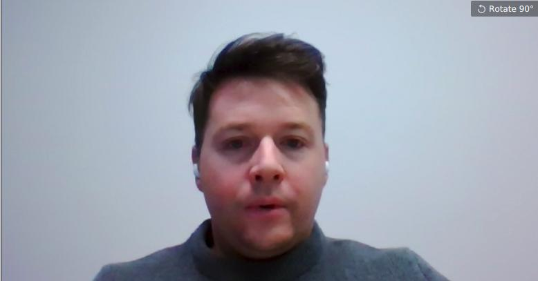
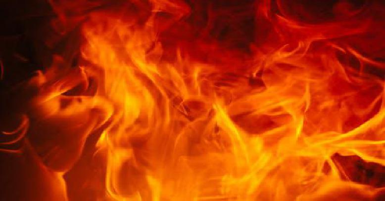
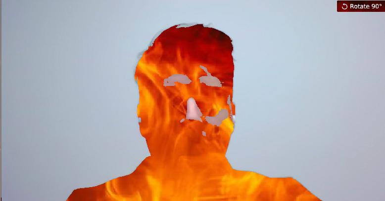

# Image Mixer Warmup

## Goal

The goal of this warmup is to create the effect of turning your instructor into the devil.

i.e, you are give two images:


and


Your goal is to make an image like this:


## Advice

### What is an image?

An image is just a 3D array of numbers. In this case, the dimensions are (rows, columns, color_channels). There are three color channels, Red, Green and Blue.

The numbers range between 0 and 255. Pure red is (255, 0, 0). pure green is (0, 255, 0). Pure blue is (0, 0, 255). 

White is (255, 255, 255) and black is (0, 0, 0)

All other colors can be created by some combination of these RGB values.

To do math and stuff on images, it is convenient to convert them to numpy arrays, and then convert back into images to display.

### Python Image Library

For this warmup, use the Python Image library (PIL).

A few useful PIL methods:

```
from PIL import Image
import numpy as np 

# open an image object from a file:
image = Image.open(filename)

# convert an image to a numpy array:
array = np.array(image)

# convert a numpy array to an image:
image = Image.fromarray(array)
# Note: for this to work, the array must have dimensions of (rows, columns, colors) and values between 0 and 255 and data type of np.int8  so maybe do it like this:

image = Image.fromarray(array.astype(np.uint8))

# to display an image:
image.show()

```

Another function you might find useful is np.stack.